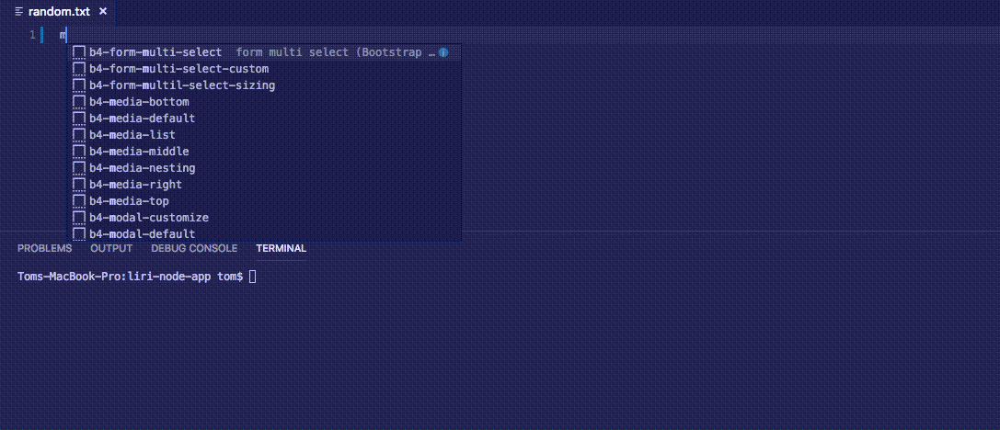

# Liri-Node-App

## What is Liri-Node-App

Liri-Node-App is a command line node.js application that utilizes various API's and npm package managers. The app runs one of three different api callbacks: 

1. "concert-this" that returns any bands next concert from bands-in-town
2. "spotify-this-song" returns a songs info from spotify API
3. "movie-this" returns any movies info from OMDB. 

## How to Use 

* User input is either entered on the command line, or can be entered in the text file within the directory. See gif examples below.

1. Done using the command line
* Enter which of the three function calls above (without quotes) and the respective band, song, or movie name you want info about(also without quotes):

```
node liri.js concert-this the rolling stones
OR
node liri.js spotify-this-song start me up
OR
node liri.js movie-this gladiator
```

2. Done using random.txt
* Enter which function and chosen band, song, or movie in text same as above without "node liri.js" in random.txt:

```
concert-this the rolling stones
OR
spotify-this-song start me up
OR
movie-this gladiator
```

* Then simply enter the code below on the command line:

```
node liri.js do-what-it-says
```

### Gif Examples

1. Done using the command line


2. Done using random.txt





### How the Code Works

User input is taken from the command line or text file and stored in variables. First, what input should be used, command line or text file, is determined from a function. Second, what function to be run is stored (i.e. concert-this, movie-this...) from either the text file or command line input and stored either with spaces replaced by "+" symbols to be used in a url for OMDB or Bands in Town, or stored in a string for Spotify. 

Based on the variables from above, a switch statement is used to run the specific function input by the user. Axios package manager (https://www.npmjs.com/package/axios) is used to retrieve data from Bands in Town and OMDB. Spotify-node-api information is retrieved using the first method from its npm documentation (https://www.npmjs.com/package/node-spotify-api).
